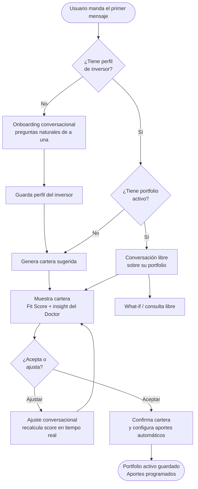
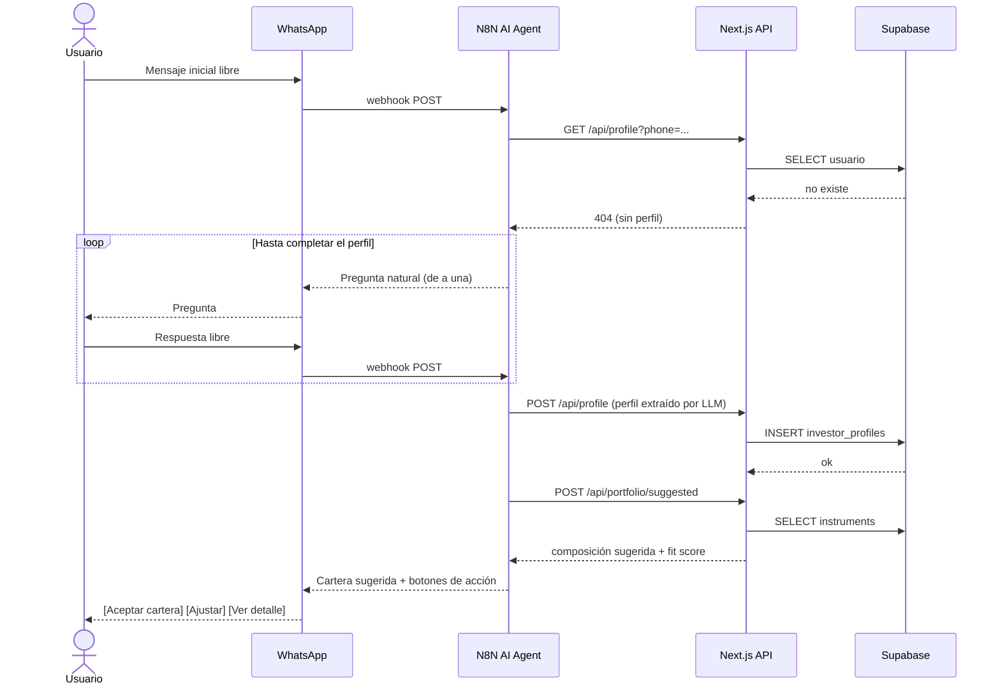
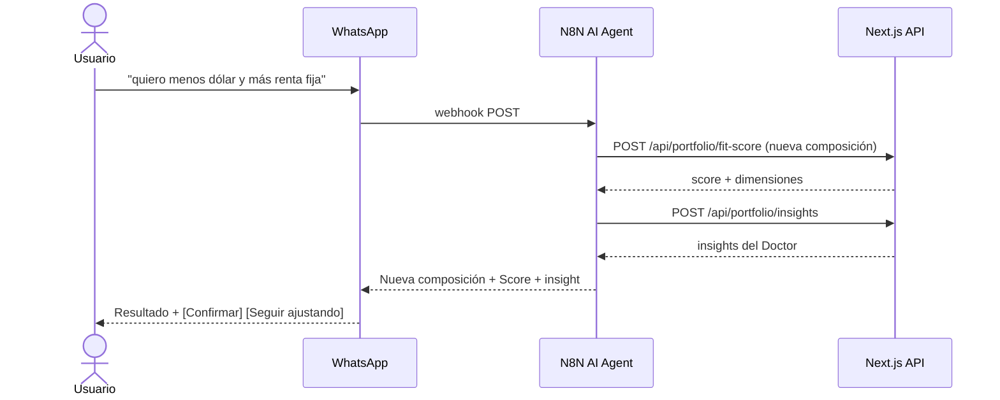
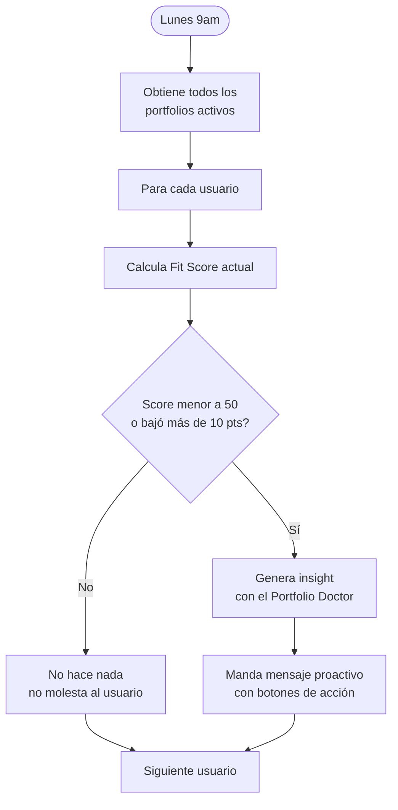
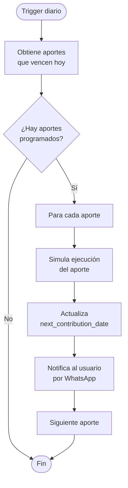

# Especificacion Funcional
**Proyecto:** HackITBA 2026
**Version:** 0.2 (pivot a WhatsApp + N8N)
**Ultima actualizacion:** 2026-03-28

---

## 1. Vision del producto

Una plataforma de smart finance que ayuda al usuario retail a convertir la inversion en un habito sostenible, mediante una estrategia personalizada, automatizacion de aportes y validacion inteligente de su cartera.

El canal principal de interaccion es **WhatsApp**: el usuario no necesita instalar ninguna app ni aprender una interfaz nueva. La experiencia es conversacional, natural y disponible en el canal que todo el mundo ya usa.

El diferencial no es solo recomendar una cartera: es estar encima del cliente, hablar con el en su lenguaje, acompanarlo proactivamente y ayudarlo a sostener buenas decisiones de inversion de forma simple y consistente.

---

## 2. Problema que resuelve

Muchas personas quieren invertir, pero no logran sostener el habito en el tiempo.

El problema no es la falta de informacion, sino la falta de constancia. Las decisiones quedan libradas al recuerdo o al momento. Incluso cuando alguien entiende que deberia invertir, no tiene una forma simple de automatizar ese comportamiento y sostenerlo como parte de su rutina.

La solucion resuelve eso con un chatbot en WhatsApp que acompana al inversor: lo perfila, le sugiere una estrategia, le recuerda sus aportes, le avisa cuando su cartera se desalinea y le manda insights utiles sin que el tenga que hacer nada.

---

## 3. Usuario objetivo

| Perfil | Descripcion |
|--------|-------------|
| Inversor nuevo | Quiere empezar a invertir pero no sabe como. Necesita una experiencia guiada, simple y que no le exija aprender una app nueva. WhatsApp baja toda la friccion. |
| Inversor con nocion | Ya tiene experiencia basica. Busca una estrategia alineada a su perfil, visibilidad sobre su cartera y automatizacion de aportes. |

Ambos perfiles comparten la necesidad de invertir con mayor constancia. WhatsApp es el canal comun que elimina la barrera de adopcion.

---

## 4. Canales del producto

El producto tiene dos superficies:

| Canal | Rol |
|-------|-----|
| **WhatsApp** | Canal principal de interaccion. Onboarding, consultas, ajuste de cartera, confirmaciones, alertas y recomendaciones proactivas. |
| **Dashboard web** | Vista complementaria (solo lectura). Muestra el portfolio activo, metricas historicas, fit score y composicion de forma visual. No tiene flujos de accion. |

El dashboard web es opcional para el usuario. Todo lo que necesita para operar esta en WhatsApp.

---

## 5. Flujo principal (WhatsApp)

### 5.1 Onboarding conversacional

El usuario inicia una conversacion con el bot. No hay formulario ni pasos forzados: el usuario habla libremente y el agente de IA extrae la informacion necesaria haciendo preguntas naturales de a una a la vez.

El agente captura:

- Experiencia previa en inversiones.
- Objetivo financiero (ahorro de corto plazo, proteccion contra inflacion, crecimiento, jubilacion u otro).
- Horizonte temporal.
- Tolerancia al riesgo (extraida del lenguaje, no de un formulario).
- Monto o porcentaje del ingreso para aportes.
- Frecuencia del aporte (semanal, quincenal, mensual).

Cuando el agente tiene suficiente informacion, guarda el perfil y avanza automaticamente a la cartera sugerida. No le pregunta al usuario si "ya termino el onboarding": la transicion es fluida y natural.

### 5.2 Cartera sugerida

El agente genera una cartera inicial basada en el perfil y la presenta en el chat con:

- Composicion en porcentajes por tipo de activo.
- Rentabilidad historica (1 mes, 3 meses, 1 año).
- Nivel de riesgo.
- Portfolio Fit Score.
- Un insight breve del Portfolio Doctor.

La presentacion usa **botones de WhatsApp Business** para las acciones posibles: "Aceptar cartera" / "Quiero ajustarla" / "Ver mas detalle".

### 5.3 Ajuste conversacional de cartera

Si el usuario quiere personalizar, lo hace hablando: "quiero menos dolar y mas renta fija", "saca las acciones", "pone mas en algo conservador". El agente interpreta el pedido, ajusta los porcentajes, recalcula el Fit Score y muestra la nueva composicion.

No hay sliders ni interfaz grafica. Los ajustes son iterativos y conversacionales. El agente puede sugerir cambios si detecta que la cartera queda fuera de perfil.

Al terminar cada ajuste, el agente muestra botones: "Confirmar esta cartera" / "Seguir ajustando".

### 5.4 Portfolio Fit Score

El agente calcula y comunica el score en lenguaje simple luego de cada cambio significativo a la cartera.

Ejemplos de como lo presenta:
- "Tu cartera tiene un score de 82/100. Esta bien alineada con tu perfil moderado."
- "Score: 41/100. Esta cartera es bastante mas agresiva de lo que tu perfil indica. Te recomiendo bajar la exposicion a renta variable."

### 5.5 Portfolio Doctor

Insights accionables generados por IA sobre la cartera actual. Se presentan como parte de la conversacion, no como un panel separado.

Ejemplos:
- "Tenes sobreexposicion en un solo sector. Considera diversificar."
- "Esta composicion es mas agresiva de lo que tu perfil indica."
- "Tu cartera tiene baja diversificacion para un horizonte de mas de 3 años."

### 5.6 What-if Simulator

El usuario puede explorar escenarios hablando naturalmente:
- "Que pasaria si aporto el doble por 6 meses?"
- "Y si bajo la proporcion de dolar?"
- "Como me iria con una cartera mas agresiva?"

El agente responde con el impacto simulado en rentabilidad historica, volatilidad y Fit Score.

### 5.7 Confirmacion y aportes automaticos

Al confirmar la cartera, el agente presenta un resumen final con botones de WhatsApp Business para confirmar. Luego registra la configuracion de aportes automaticos.

En el MVP, los aportes automaticos estan **mockeados**: el sistema simula la ejecucion en las fechas configuradas y notifica al usuario por WhatsApp ("Tu aporte mensual de $X fue procesado.").

---

## 6. Flows proactivos (bot → usuario)

El bot manda mensajes al usuario sin que este haya preguntado, en dos escenarios:

### 6.1 Revision semanal de cartera

Una vez por semana, el sistema evalua el portfolio activo del usuario:
- Calcula si el Fit Score bajo significativamente.
- Detecta desbalance o sobreexposicion.
- Si encuentra algo relevante, manda un mensaje con el insight y una sugerencia accionable.
- Si todo esta bien, no molesta al usuario.

Ejemplo de mensaje proactivo:
> "Hola! Revise tu cartera esta semana. Tu exposicion en renta variable subio al 70%, lo que esta por encima de tu perfil moderado. Queres que lo rebalanceemos?"

Botones sugeridos: "Si, rebalancear" / "Dejalo asi" / "Ver detalle"

### 6.2 Recordatorio de aporte (MVP)

Cuando llega la fecha de aporte configurada, el bot notifica al usuario y simula la ejecucion del debito.

---

## 7. Features del MVP

| Feature | Canal | Estado en MVP |
|---------|-------|---------------|
| Onboarding conversacional libre | WhatsApp | Incluido |
| Extraccion de perfil por LLM | N8N / AI Agent | Incluido |
| Cartera sugerida con botones de accion | WhatsApp | Incluido |
| Ajuste conversacional de cartera | WhatsApp | Incluido |
| Portfolio Fit Score en el chat | WhatsApp | Incluido |
| Portfolio Doctor con insights de AI | WhatsApp | Incluido |
| What-if Simulator conversacional | WhatsApp | Incluido |
| Confirmacion y guardado de cartera | WhatsApp | Incluido |
| Aporte automatico mockeado | WhatsApp | Incluido |
| Revision semanal proactiva | N8N (scheduled) | Incluido |
| Dashboard web (solo lectura) | Web | Incluido |
| Crowd intelligence por perfiles similares | - | Roadmap |
| Alerta de mercado en tiempo real | - | Roadmap |
| Debito automatico real | - | Roadmap |
| Marketplace de carteras | - | Roadmap |
| Inversion tokenizada | - | Roadmap |

---

## 8. Experiencia con WhatsApp Business

- Las **opciones de accion** siempre usan botones o listas de WhatsApp Business. El usuario nunca tiene que escribir "1" o "2" para elegir una opcion.
- Las **preguntas abiertas** son libres: el usuario escribe lo que quiere y el LLM interpreta.
- Los **mensajes del bot** son cortos, en primera persona y sin jerga financiera tecnica.
- El bot tiene personalidad definida: cercana, directa, sin sonar a un banco.

---

## 9. Modelo de negocio

### Tier gratuito
- Onboarding completo.
- Cartera sugerida.
- Ajuste basico de cartera.
- Portfolio Fit Score basico.

### Tier premium
- Portfolio Doctor con insights avanzados.
- What-if Simulator completo.
- Revisiones proactivas semanales.
- Escenarios de simulacion extendidos.
- Crowd intelligence con perfiles similares.

### B2B / white-label (roadmap)
- Licenciamiento del motor de perfilado y validacion de carteras para bancos, brokers o fintechs.

---

## 10. Wording y posicionamiento

| Usar | Evitar |
|------|--------|
| Cartera personalizada | Fondo propio |
| Portfolio inteligente | Fondo de inversion |
| Estrategia de inversion | Crear un fondo |
| Composicion de activos | Administrar un fondo |

---

## 11. Criterios de exito del MVP

- El usuario puede completar el flujo completo de punta a punta por WhatsApp: onboarding → cartera sugerida → ajuste → confirmacion.
- El bot interpreta correctamente el perfil del usuario a partir de una conversacion libre.
- El Portfolio Fit Score se comunica en lenguaje simple despues de cada cambio.
- El Portfolio Doctor genera al menos un insight relevante para cualquier composicion.
- El What-if Simulator responde con impacto visible ante preguntas naturales.
- El flow proactivo semanal envia un mensaje coherente con el estado real del portfolio.
- La experiencia es entendible sin conocimiento financiero previo.

---

## 12. Restricciones y decisiones tomadas

- El MVP no ejecuta inversiones reales ni integra debito automatico real.
- El MVP no administra fondos regulados. Opera con carteras de simulacion y recomendacion.
- Los datos de rentabilidad historica son informativos y no constituyen asesoramiento financiero regulado.
- La AI actua como capa de explicacion y alertas, no como asesor financiero ni entidad regulada.
- El dashboard web es de solo lectura: no tiene flujos de onboarding ni edicion de cartera.

---

## 13. Roadmap de producto

### Fase 1 (MVP - HackITBA 2026)
- Onboarding conversacional por WhatsApp.
- Cartera sugerida y ajuste conversacional.
- Portfolio Fit Score y Portfolio Doctor en el chat.
- What-if Simulator conversacional.
- Aporte automatico mockeado.
- Revision semanal proactiva.
- Dashboard web de solo lectura.

### Fase 2
- Crowd intelligence por perfiles similares.
- Goal-first investing (el flujo arranca por meta, no por instrumento).
- Rebalanceo inteligente.
- Alertas de mercado en tiempo real.

### Fase 3
- Marketplace curado de estrategias.
- Integracion con partners regulados para ejecucion real.
- Debito automatico e inversion tokenizada con partner.
