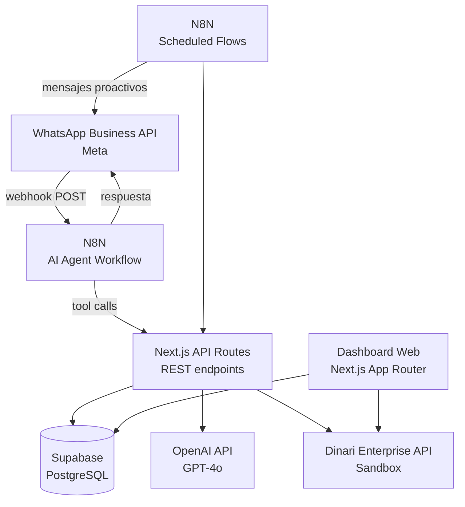
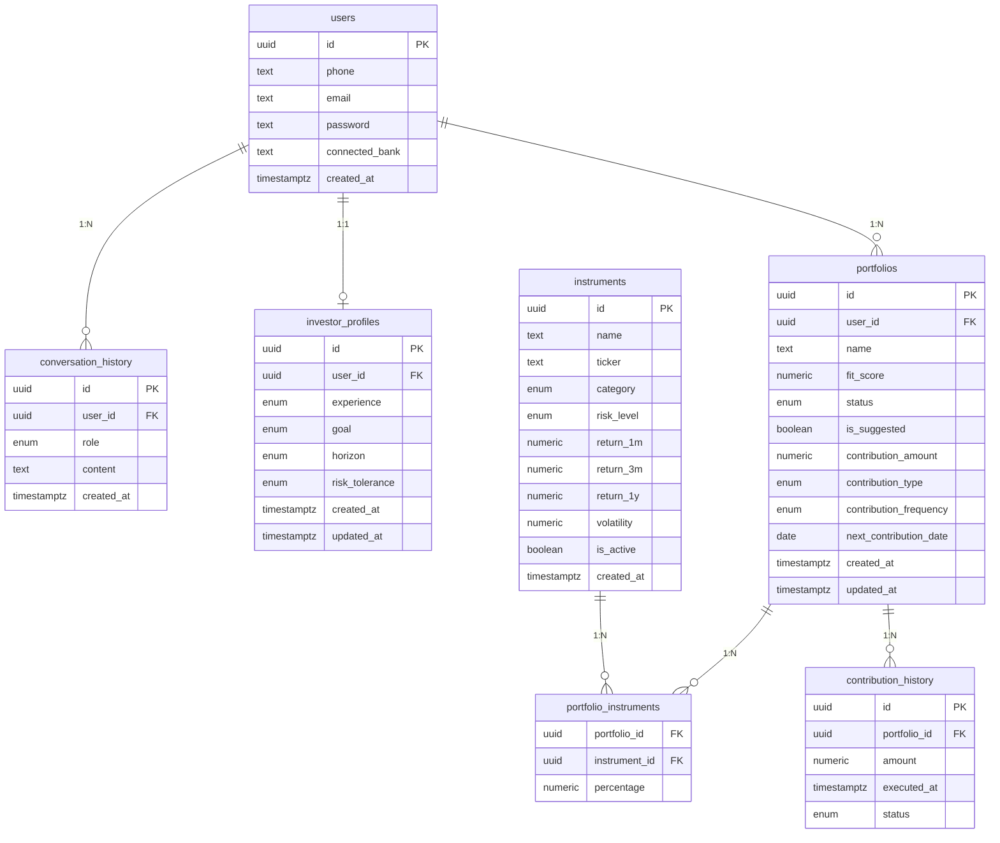

# Especificacion Tecnica
**Proyecto:** HackITBA 2026
**Version:** 0.4
**Ultima actualizacion:** 2026-03-28

---

## 1. Objetivo

Este documento describe la arquitectura, componentes, decisiones tecnicas y alcance de implementacion del MVP. El sistema combina un chatbot conversacional en WhatsApp (orquestado por N8N) con un dashboard web interactivo (Next.js), ambos respaldados por una base de datos en Supabase.

---

## 2. Arquitectura general



### Componentes

| Componente | Tecnologia | Rol |
|------------|-----------|-----|
| WhatsApp Business API | Meta (oficial) | Canal de mensajeria entrante y saliente |
| N8N (chat workflow) | N8N Cloud o self-hosted | Recibe mensajes, ejecuta AI Agent, envia respuestas |
| N8N (scheduled flows) | N8N Cloud o self-hosted | Flows proactivos: revision semanal, recordatorios |
| Next.js API Routes | Next.js 16 (App Router) | Backend REST: logica de negocio, calculo de scores, acceso a DB |
| Dashboard web | Next.js 16 (App Router) | Frontend interactivo: login, dashboard, editor de cartera, config de debito |
| Supabase | PostgreSQL gestionado | Base de datos persistente |
| OpenAI GPT-4o | OpenAI API | LLM para el AI Agent y generacion de insights |
| Dinari Enterprise API | Sandbox | Datos de stocks del mercado americano (metadata, logos, simbolos) |

### Principios de diseno

- N8N es el orquestador conversacional. No contiene logica de negocio: delega todo a la API de Next.js via tool calls.
- La API de Next.js es stateless y RESTful. Es la unica capa que toca la base de datos (salvo el dashboard que lee directamente via Server Components).
- El dashboard web usa Server Components para leer datos directamente de Supabase (seguridad: service_role key nunca llega al browser).
- Autenticacion del dashboard: login mock con email/password plain text y cookie `user_id` HttpOnly.
- Autenticacion de la API interna: header `x-api-key` para endpoints llamados desde N8N.
- Endpoints del dashboard (save, bank, debit) se autentican via la cookie de sesion.

---

## 3. N8N: AI Agent Workflow (flujo conversacional)

### Trigger

Webhook POST configurado como endpoint receptor del WhatsApp Business API.

### Tools del AI Agent

Cada tool es una llamada HTTP a la API de Next.js con header `x-api-key`.

| Tool | Metodo | Endpoint | Descripcion |
|------|--------|----------|-------------|
| `get_investor_profile` | GET | `/api/profile?phone={phone}` | Lee el perfil del usuario |
| `save_investor_profile` | POST | `/api/profile` | Guarda o actualiza el perfil |
| `get_portfolio` | GET | `/api/portfolio?phone={phone}` | Trae el portfolio activo |
| `suggest_portfolio` | POST | `/api/portfolio/suggested` | Genera cartera sugerida segun perfil |
| `save_portfolio` | POST | `/api/portfolio` | Guarda cambios a la cartera |
| `calculate_fit_score` | POST | `/api/portfolio/fit-score` | Calcula el score para una composicion |
| `get_portfolio_insights` | POST | `/api/portfolio/insights` | Genera insights del Portfolio Doctor |
| `simulate_whatif` | POST | `/api/portfolio/simulate` | Simula un escenario what-if |
| `mock_transfer` | POST | `/api/transfer/mock` | Simula aporte automatico |
| `get_market_data` | GET | `/api/market-data` | Instrumentos + datos de Dinari |

### Memoria de conversacion

- El historial se guarda en la tabla `conversation_history` de Supabase.
- El AI Agent carga los ultimos N mensajes al inicio de cada interaccion.
- Ventana de contexto: configurable, sugerido 20 mensajes.

---

## 4. N8N: Scheduled Flows (flows proactivos)

### Flow 1: Revision semanal de cartera

Trigger: Lunes 9am. Obtiene todos los portfolios activos (`GET /api/portfolios/all-active`), calcula fit score, y si detecta desalineacion envia mensaje proactivo via WhatsApp.

### Flow 2: Recordatorio de aporte

Trigger: Diario. Obtiene aportes que vencen hoy (`GET /api/contributions/due-today`), simula ejecucion (`POST /api/transfer/mock`), actualiza `next_contribution_date` y notifica al usuario.

---

## 5. Next.js: API Routes

### Stack

- Framework: **Next.js 16** (App Router) con TypeScript.
- Base de datos: **Supabase** via `@supabase/supabase-js` con `service_role` key (server-side only).
- LLM: OpenAI GPT-4o via `openai` SDK (opcional).
- Stocks: **Dinari Enterprise API** (sandbox).
- Validacion: **Zod** para request bodies en endpoints internos.
- Deploy: **Vercel**.

### Endpoints internos (protegidos con `x-api-key`)

```
# Perfil del inversor
GET    /api/profile?phone={phone}
POST   /api/profile

# Portfolio
GET    /api/portfolio?phone={phone}
POST   /api/portfolio/suggested
POST   /api/portfolio
POST   /api/portfolio/fit-score
POST   /api/portfolio/insights
POST   /api/portfolio/simulate

# Datos internos (para flows proactivos)
GET    /api/portfolios/all-active
GET    /api/contributions/due-today

# Mercado
GET    /api/market-data

# Transfers mockeados
POST   /api/transfer/mock
```

### Endpoints del dashboard (protegidos con cookie de sesion)

```
# Autenticacion
POST   /api/auth/login
POST   /api/auth/logout
GET    /api/auth/me

# Guardar cartera desde el editor
POST   /api/portfolio/save-from-dashboard

# Banco y debito
POST   /api/bank/connect
POST   /api/debit/setup
```

---

## 6. Next.js: Dashboard Web

### Paginas

| Ruta | Tipo | Descripcion |
|------|------|-------------|
| `/login` | Client Component | Formulario email/password. Redirige a `/` on success. |
| `/` | Server Component | Dashboard principal. Redirige a `/login` si no hay sesion. |
| `/portfolio/edit` | Server + Client Component | Editor de cartera con Dinari stocks. |
| `/debit/setup` | Server + Client Component | Seleccion de banco + config de debito automatico. |

### Componentes del dashboard

| Componente | Archivo | Descripcion |
|------------|---------|-------------|
| `DashboardContent` | `components/dashboard/DashboardContent.tsx` | Container principal. Warning banner, header, layout. |
| `HistoricalReturns` | `components/dashboard/HistoricalReturns.tsx` | Cards de retornos 1m/3m/1y. |
| `CompositionChart` | `components/portfolio/CompositionChart.tsx` | Pie chart con Recharts. Paleta de 20 colores unicos. |
| `FitScoreWidget` | `components/portfolio/FitScoreWidget.tsx` | SVG ring + breakdown bars. |
| `InsightsPanel` | `components/dashboard/InsightsPanel.tsx` | Insights del Portfolio Doctor. |
| `ContributionHistory` | `components/dashboard/ContributionHistory.tsx` | Tabla de aportes + proximo aporte. |
| `PortfolioEditor` | `components/portfolio/PortfolioEditor.tsx` | Editor con allocations, chart live, fit score, Dinari tab. |
| `DebitSetupForm` | `components/debit/DebitSetupForm.tsx` | 2-step: banco selection grid + debit config. |

### Estilos

- Tailwind CSS.
- Tema claro (fondo blanco `#ffffff`, cards `bg-white`, bordes `border-gray-200`).
- Contraste WCAG AA: textos principales `text-gray-900`, secundarios `text-gray-500`.

---

## 7. Integracion con Dinari Enterprise API

### Configuracion

- Base URL: `https://api-enterprise.sandbox.dinari.com/api/v2`
- Autenticacion: headers `X-API-Key-Id` + `X-API-Secret-Key`.
- Credenciales en variables de entorno: `DINARI_API_KEY_ID`, `DINARI_API_SECRET_KEY`.

### Uso

- El endpoint `GET /api/market-data` enriquece los instrumentos locales con datos de Dinari.
- La pagina `/portfolio/edit` carga stocks de Dinari via `getStocks()` y los muestra en el tab "Stocks".
- Al guardar una cartera con stocks de Dinari, el endpoint `save-from-dashboard` hace upsert en la tabla `instruments` usando el `ticker` como clave, con:
  - `category`: `renta_variable`
  - `risk_level`: `high`
  - `return_1m/3m/1y`: valores mockeados (2.0, 6.0, 25.0)
  - `volatility`: 15.0

### Interface `DinariStock`

```typescript
interface DinariStock {
  id: string;
  name: string;
  symbol: string;
  is_fractionable: boolean;
  is_tradable: boolean;
  tokens: string[];
  composite_figi: string | null;
  cusip: string | null;
  cik: string | null;
  display_name: string | null;
  description: string | null;
  logo_url: string | null;
}
```

---

## 8. Motor de Portfolio Fit Score

Se calcula en el servidor (Next.js API) y en el cliente (editor, via import directo) a partir de cinco dimensiones:

| Dimension | Descripcion | Peso |
|-----------|-------------|------|
| Alineacion de riesgo | Compatibilidad entre composicion y tolerancia al riesgo declarada. | 30% |
| Coherencia con objetivo | Si la cartera sirve para el objetivo definido. | 25% |
| Diversificacion | Distribucion entre categorias. Penaliza concentracion excesiva. | 20% |
| Consistencia historica | Volatilidad y rendimiento historico de los activos incluidos. | 15% |
| Coherencia temporal | Si el perfil de riesgo es apropiado para el horizonte declarado. | 10% |

Para el calculo client-side en el editor, se usa `registerInstruments()` para registrar instrumentos de Supabase y Dinari en el runtime del modulo `market-data`, permitiendo que `getInstrumentById()` los resuelva.

---

## 9. Base de datos (Supabase)

### Migraciones

| Archivo | Contenido |
|---------|-----------|
| `001_initial_schema.sql` | 7 tablas, 11 enums, indices, FKs |
| `002_mock_auth.sql` | Agrega `email` y `password` a `users` |
| `003_connected_bank.sql` | Agrega `connected_bank` a `users` |

### Tablas

#### `users`

| Campo | Tipo | Notas |
|-------|------|-------|
| `id` | uuid | PK |
| `phone` | text | UNIQUE. Formato E.164 |
| `email` | text | UNIQUE. Para login web |
| `password` | text | Plain text (MVP only) |
| `connected_bank` | text | ID del banco conectado |
| `created_at` | timestamptz | |

#### `conversation_history`

| Campo | Tipo | Notas |
|-------|------|-------|
| `id` | uuid | PK |
| `user_id` | uuid | FK a `users.id` |
| `role` | enum | `user`, `assistant` |
| `content` | text | |
| `created_at` | timestamptz | |

#### `investor_profiles`

| Campo | Tipo | Notas |
|-------|------|-------|
| `id` | uuid | PK |
| `user_id` | uuid | FK a `users.id`, UNIQUE |
| `experience` | enum | `none`, `basic`, `intermediate`, `advanced` |
| `goal` | enum | `short_term`, `inflation`, `growth`, `retirement`, `other` |
| `horizon` | enum | `less_1y`, `1_to_3y`, `more_3y` |
| `risk_tolerance` | enum | `conservative`, `moderate`, `aggressive` |
| `created_at` | timestamptz | |
| `updated_at` | timestamptz | |

#### `instruments`

| Campo | Tipo | Notas |
|-------|------|-------|
| `id` | uuid | PK |
| `name` | text | |
| `ticker` | text | nullable. Usado para match con Dinari stocks |
| `category` | enum | `renta_fija`, `renta_variable`, `dolar`, `mixto`, `commodities` |
| `risk_level` | enum | `low`, `medium`, `high` |
| `return_1m` | numeric | |
| `return_3m` | numeric | |
| `return_1y` | numeric | |
| `volatility` | numeric | |
| `is_active` | boolean | default `true` |
| `created_at` | timestamptz | |

#### `portfolios`

| Campo | Tipo | Notas |
|-------|------|-------|
| `id` | uuid | PK |
| `user_id` | uuid | FK a `users.id` |
| `name` | text | |
| `fit_score` | numeric | 0-100 |
| `status` | enum | `draft`, `active`, `archived` |
| `is_suggested` | boolean | |
| `contribution_amount` | numeric | Monto del aporte periodico |
| `contribution_type` | enum | `percentage`, `fixed` |
| `contribution_frequency` | enum | `weekly`, `biweekly`, `monthly` |
| `next_contribution_date` | date | |
| `created_at` | timestamptz | |
| `updated_at` | timestamptz | |

#### `portfolio_instruments`

| Campo | Tipo | Notas |
|-------|------|-------|
| `portfolio_id` | uuid | FK a `portfolios.id` |
| `instrument_id` | uuid | FK a `instruments.id` |
| `percentage` | numeric | 0-100, suma por portfolio = 100 |

PK compuesta: `(portfolio_id, instrument_id)`.

#### `contribution_history`

| Campo | Tipo | Notas |
|-------|------|-------|
| `id` | uuid | PK |
| `portfolio_id` | uuid | FK a `portfolios.id` |
| `amount` | numeric | |
| `executed_at` | timestamptz | |
| `status` | enum | `simulated`, `pending` |

### Seed data

- 8 instrumentos argentinos (money market, bonos, dolar MEP, ONs, FCI mixto, acciones, CEDEARs, commodities).
- 1 usuario demo: `demo@hackitba.com` / `demo123`, phone `+5491100000000`.
- 1 perfil de inversor: basico, growth, 1-3 años, moderado.
- 1 portfolio activo: "Cartera Moderada", fit score 78, con 5 instrumentos.
- 3 aportes historicos simulados de $50.000.

### Diagrama de relaciones



---

## 10. Infraestructura y deployment

| Capa | Plataforma |
|------|-----------|
| Dashboard web + API Routes | **Vercel** (`hackitba-2026.vercel.app`) |
| Base de datos | **Supabase** (proyecto `wcvxtszryuvxfvrpiqrm`) |
| Orquestacion conversacional | **N8N** (Cloud o self-hosted) |
| WhatsApp | **WhatsApp Business API** (Meta) |
| LLM | **OpenAI GPT-4o** (opcional) |
| Stocks | **Dinari Enterprise API** (sandbox) |

### Variables de entorno (Vercel)

```
NEXT_PUBLIC_SUPABASE_URL=         # URL del proyecto Supabase
SUPABASE_SERVICE_ROLE_KEY=        # Service role key (server-side only)
INTERNAL_API_KEY=                 # API key para endpoints internos (N8N)
DINARI_API_KEY_ID=                # Dinari API Key ID
DINARI_API_SECRET_KEY=            # Dinari API Secret Key
OPENAI_API_KEY=                   # OpenAI (opcional, para insights con AI)
```

### Variables de entorno (N8N)

```
WHATSAPP_ACCESS_TOKEN=            # Token de WhatsApp Business API
WHATSAPP_PHONE_NUMBER_ID=        # ID del numero de WhatsApp Business
NEXT_API_BASE_URL=               # URL base (ej: https://hackitba-2026.vercel.app)
NEXT_INTERNAL_API_KEY=           # Mismo valor que INTERNAL_API_KEY en Vercel
OPENAI_API_KEY=                  # Para el AI Agent node en N8N
```

---

## 11. Gestion de ramas

El proyecto sigue Gitflow. Ver `.cursor/rules/gitflow.mdc` para el flujo completo.

| Rama | Proposito |
|------|-----------|
| `master` | Produccion |
| `develop` | Integracion continua |
| `feature/*` | Features en desarrollo paralelo |

Repositorio: `github.com/merianro/hackitba-2026`

---

## 12. Decisiones tecnicas tomadas

| Decision | Razon |
|----------|-------|
| Login mock (email/password plain text, cookie session) | Suficiente para demo. Elimina complejidad de OAuth/JWT para el hackathon. |
| WhatsApp como canal principal | Elimina friccion de adopcion. No hay app que instalar. |
| Dashboard web interactivo (no solo lectura) | El usuario puede editar su cartera, conectar banco y configurar debito directamente. |
| Dinari Enterprise API para stocks | Provee datos reales de acciones del mercado americano (sandbox). |
| Colores unicos por activo en pie chart (paleta de 20) | Evita confusion visual. Cada instrumento tiene un color diferente sin importar la categoria. |
| `registerInstruments()` para fit score client-side | Permite que el motor de fit score resuelva instrumentos de Supabase y Dinari en el browser sin llamada a API. |
| N8N como orquestador con AI Agent | Permite flujo conversacional libre sin codigo de estado manual. |
| Next.js como API backend (no N8N) | Logica de negocio versionada y testeable en codigo. N8N solo orquesta y delega. |
| Server Components para el dashboard | Datos se leen directamente de Supabase en el servidor. El service_role key nunca llega al browser. |
| Validacion estricta de 100% | Frontend deshabilita el boton si total != 100%. Backend rechaza con 400 si no suma 100%. |
| Sin RLS en MVP | Acceso server-side con service_role key. Se activa en iteracion posterior. |
| Transfers mockeados | Evita complejidad regulatoria y reduce scope a lo demostrable en el hackathon. |
| Deploy en Vercel | Automatico, serverless, mismo proyecto para web + API. |
