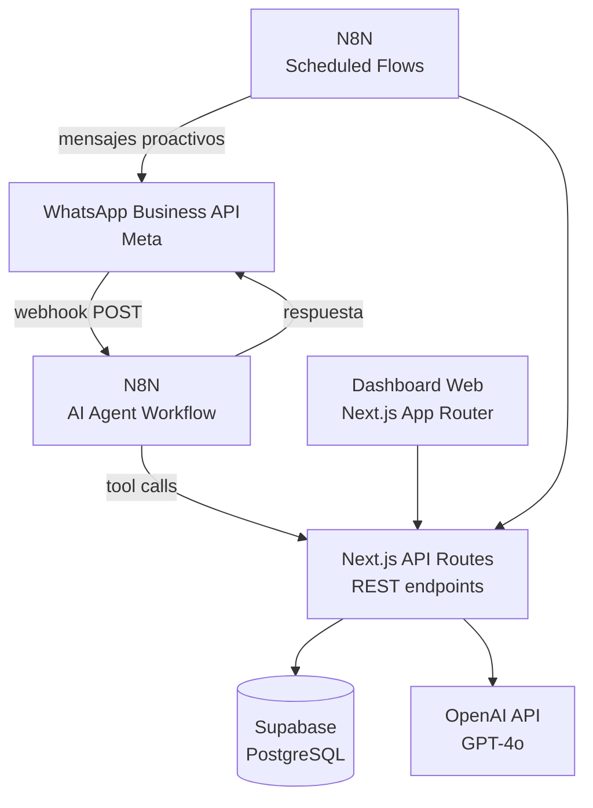
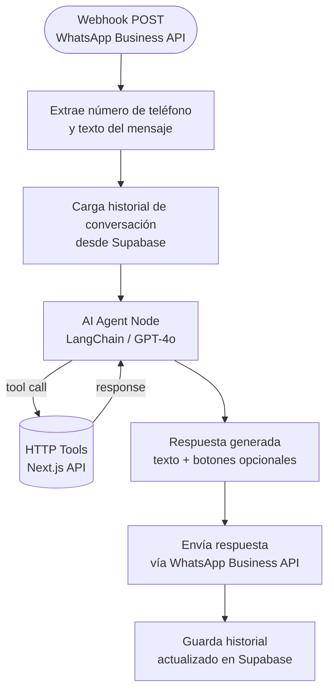
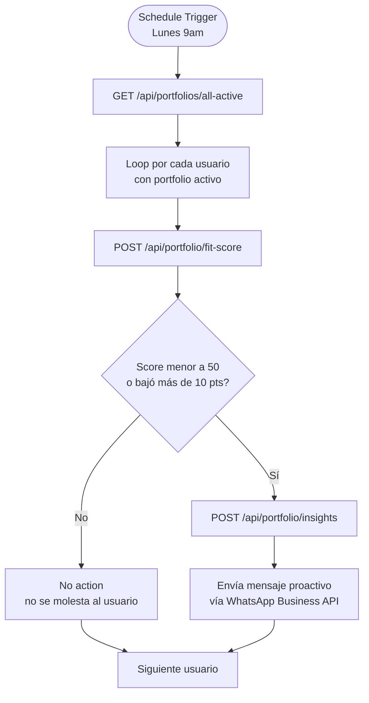
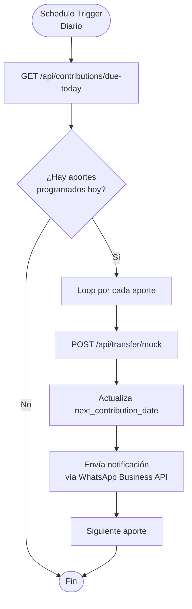
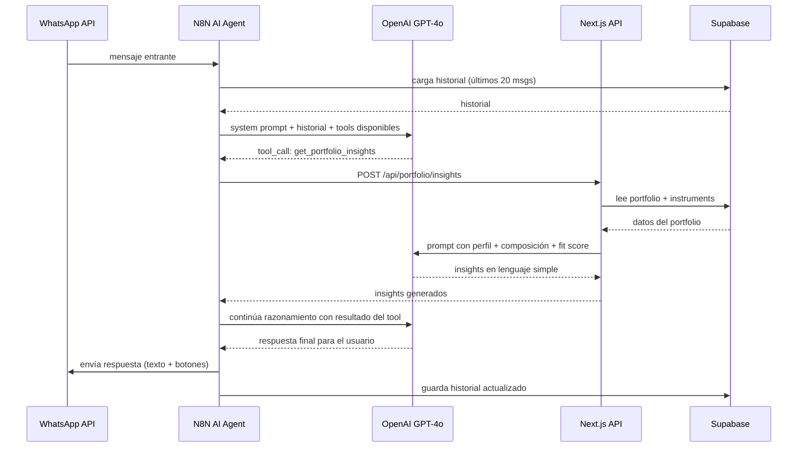
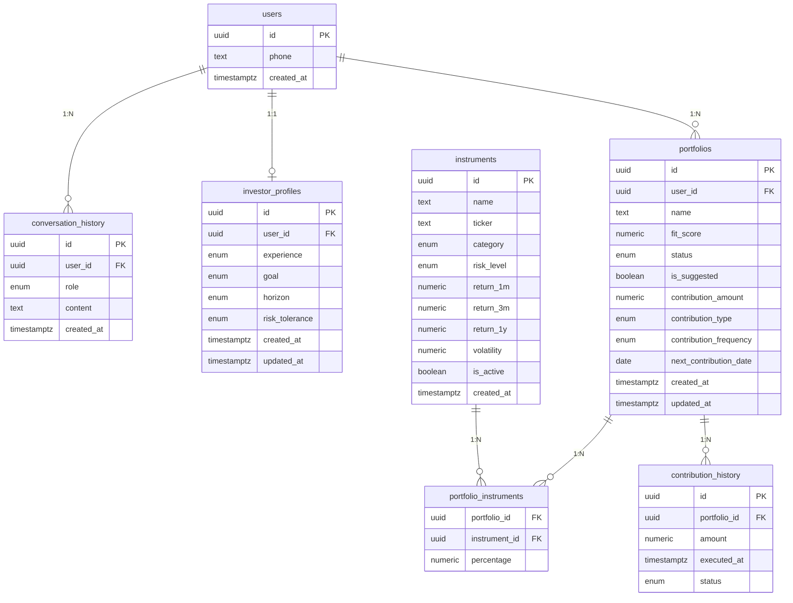
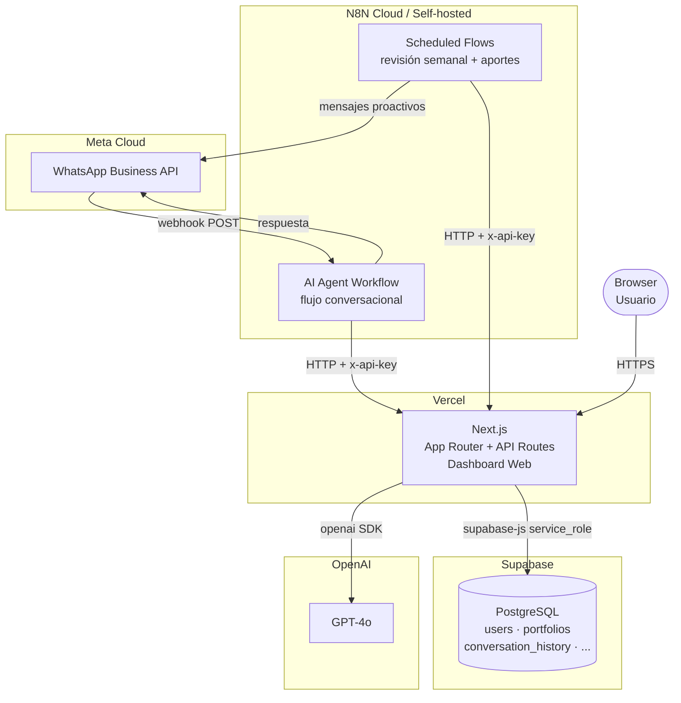

# Especificacion Tecnica
**Proyecto:** HackITBA 2026
**Version:** 0.3 (pivot a WhatsApp + N8N)
**Ultima actualizacion:** 2026-03-28

---

## 1. Objetivo

Este documento describe la arquitectura, componentes, decisiones tecnicas y alcance de implementacion del MVP. El sistema pivoto de una web app interactiva a un chatbot conversacional en WhatsApp orquestado por N8N, con una web app de solo lectura como superficie complementaria.

---

## 2. Arquitectura general

El sistema tiene tres componentes principales que se comunican entre si:



### Componentes

| Componente | Tecnologia | Rol |
|------------|-----------|-----|
| WhatsApp Business API | Meta (oficial) | Canal de mensajeria entrante y saliente |
| N8N (chat workflow) | N8N Cloud o self-hosted | Recibe mensajes, ejecuta AI Agent, envia respuestas |
| N8N (scheduled flows) | N8N Cloud o self-hosted | Flows proactivos: revision semanal, recordatorios |
| Next.js API Routes | Next.js (App Router) | Backend REST: logica de negocio, calculo de scores, acceso a DB |
| Dashboard web | Next.js (App Router) | Frontend de solo lectura: portfolios, metricas, composicion |
| Supabase | PostgreSQL gestionado | Base de datos persistente |
| OpenAI GPT-4o | OpenAI API | LLM para el AI Agent y generacion de insights |

### Principios de diseno

- N8N es el orquestador conversacional. No contiene logica de negocio: delega todo a la API de Next.js via tool calls.
- La API de Next.js es stateless y RESTful. Es la unica capa que toca la base de datos.
- El dashboard web consume la misma API. No tiene logica propia.
- Sin autenticacion en MVP: el usuario se identifica por su numero de telefono de WhatsApp.
- Las llamadas a OpenAI se hacen exclusivamente desde el servidor (Next.js API Routes), nunca desde N8N directamente para la logica de negocio.

---

## 3. N8N: AI Agent Workflow (flujo conversacional)

### Trigger

Webhook POST configurado como endpoint receptor del WhatsApp Business API. Cada mensaje entrante dispara el workflow.

### Estructura del workflow



### Tools del AI Agent

Cada tool es una llamada HTTP a la API de Next.js. El agente decide cuándo llamar a cada una.

| Tool | Metodo | Endpoint | Descripcion |
|------|--------|----------|-------------|
| `get_investor_profile` | GET | `/api/profile?phone={phone}` | Lee el perfil del usuario por numero de telefono |
| `save_investor_profile` | POST | `/api/profile` | Guarda o actualiza el perfil extraido del onboarding |
| `get_portfolio` | GET | `/api/portfolio?phone={phone}` | Trae el portfolio activo del usuario |
| `suggest_portfolio` | POST | `/api/portfolio/suggested` | Genera cartera sugerida segun perfil |
| `save_portfolio` | POST | `/api/portfolio` | Guarda cambios a la cartera |
| `calculate_fit_score` | POST | `/api/portfolio/fit-score` | Calcula el score para una composicion dada |
| `get_portfolio_insights` | POST | `/api/portfolio/insights` | Genera insights del Portfolio Doctor |
| `simulate_whatif` | POST | `/api/portfolio/simulate` | Simula un escenario what-if |
| `mock_transfer` | POST | `/api/transfer/mock` | Simula la ejecucion de un aporte automatico y actualiza `next_contribution_date` segun la frecuencia configurada |
| `get_market_data` | GET | `/api/market-data` | Lee instrumentos disponibles y datos historicos |

### System prompt del AI Agent

El system prompt define:
- Personalidad: cercana, directa, sin jerga financiera tecnica.
- Restricciones regulatorias: no dar consejos de compra/venta, incluir disclaimer.
- Instruccion de usar botones y listas de WhatsApp Business para opciones (formato especifico segun API de Meta).
- Instruccion de preguntar de a una cosa a la vez durante el onboarding.
- Instruccion de llamar a `save_investor_profile` cuando tenga suficiente informacion del perfil.

### Memoria de conversacion

- El historial se guarda en la tabla `conversation_history` de Supabase, indexado por numero de telefono.
- El AI Agent carga los ultimos N mensajes al inicio de cada interaccion y los guarda al terminar.
- Ventana de contexto: configurable, sugerido 20 mensajes para el MVP.

---

## 4. N8N: Scheduled Flows (flows proactivos)

### Flow 1: Revision semanal de cartera



### Flow 2: Recordatorio de aporte



---

## 5. Next.js: API Routes

### Stack

- Framework: **Next.js** (App Router) con TypeScript.
- Base de datos: **Supabase** via `@supabase/supabase-js` con `service_role` key (server-side only).
- LLM: OpenAI GPT-4o via `openai` SDK.
- Deploy: **Vercel**.

### Endpoints

```
# Perfil del inversor
GET    /api/profile?phone={phone}        # Leer perfil por numero de telefono
POST   /api/profile                      # Crear o actualizar perfil

# Portfolio
GET    /api/portfolio?phone={phone}      # Traer portfolio activo del usuario
POST   /api/portfolio/suggested          # Generar cartera sugerida segun perfil
POST   /api/portfolio                    # Guardar cartera personalizada
POST   /api/portfolio/fit-score          # Calcular score para una composicion
POST   /api/portfolio/insights           # Generar insights del Portfolio Doctor
POST   /api/portfolio/simulate           # Simular escenario what-if

# Datos internos (para flows proactivos)
GET    /api/portfolios/all-active        # Todos los portfolios activos (uso interno N8N)
GET    /api/contributions/due-today      # Aportes que vencen hoy

# Mercado
GET    /api/market-data                  # Instrumentos y datos historicos

# Transfers mockeados
POST   /api/transfer/mock                # Simula ejecucion de aporte
```

### Autenticacion de la API

En MVP: los endpoints de uso interno (llamados desde N8N) se protegen con un API key estatico enviado como header `x-api-key`. No hay auth de usuario.

---

## 6. Next.js: Dashboard Web

### Rol

Superficie de solo lectura. El usuario puede abrir el dashboard para ver su portfolio de forma visual. No hay onboarding, no hay edicion, no hay acciones.

### Modulos

| Modulo | Descripcion |
|--------|-------------|
| `PortfolioView` | Composicion actual de la cartera en graficos (torta / barras). |
| `FitScoreDisplay` | Score actual con etiqueta y descripcion. |
| `HistoricalReturns` | Rentabilidad a 1 mes, 3 meses, 1 año. |
| `InsightsPanel` | Ultimos insights del Portfolio Doctor. |
| `ContributionHistory` | Historial de aportes automaticos (mockeados). |

### Acceso

En MVP: el usuario accede al dashboard con un usuario hardcodeado (sin login real). La app carga directamente el portfolio del usuario mock sin pantalla de autenticacion.

En produccion: el usuario se loguea con Google u otro proveedor OAuth. Al registrarse vincula su cuenta con su numero de WhatsApp. El dashboard muestra los datos del usuario autenticado. Esta capa de auth queda fuera del scope del hackathon.

### Stack

- Framework: **Next.js** (App Router) con TypeScript.
- Estilos: Tailwind CSS.
- Graficos: Recharts o similar.
- Deploy: **Vercel** (mismo proyecto que la API).

---

## 7. Motor de Portfolio Fit Score

Sin cambios respecto a la version anterior. Se calcula en el servidor (Next.js API) a partir de las siguientes dimensiones:

| Dimension | Descripcion | Peso |
|-----------|-------------|------|
| Alineacion de riesgo | Compatibilidad entre composicion y tolerancia al riesgo declarada. | 30% |
| Coherencia con objetivo | Si la cartera sirve para el objetivo definido. | 25% |
| Diversificacion | Distribucion entre categorias. Penaliza concentracion excesiva. | 20% |
| Consistencia historica | Volatilidad y rendimiento historico de los activos incluidos. | 15% |
| Coherencia temporal | Si el perfil de riesgo es apropiado para el horizonte declarado. | 10% |

| Rango | Etiqueta |
|-------|----------|
| 85-100 | Muy alineado |
| 65-84 | Alineado |
| 45-64 | Moderadamente fuera de perfil |
| 0-44 | Fuera de perfil |

---

## 8. Integracion con AI (OpenAI)

### Donde vive

- El AI Agent corre en N8N (nodo nativo de LangChain en N8N).
- Las llamadas a OpenAI para insights del Portfolio Doctor y simulaciones what-if se hacen desde **Next.js API Routes** (los endpoints `/api/portfolio/insights` y `/api/portfolio/simulate`).
- N8N nunca llama a OpenAI directamente para logica de negocio: delega a los endpoints de Next.js.

### Prompt design para insights y simulaciones

Los prompts incluyen siempre:
- Perfil del usuario (objetivo, horizonte, tolerancia al riesgo, experiencia).
- Composicion actual de la cartera en porcentajes.
- Datos de rentabilidad y volatilidad historica de cada instrumento.
- Portfolio Fit Score calculado.
- Instruccion de responder en lenguaje simple, sin jerga tecnica.
- Disclaimer obligatorio al final de cada respuesta.

### Flujo de una llamada con tool call



### Restricciones

- La AI no da consejos de compra/venta de activos especificos.
- La AI no simula retornos futuros como garantia.
- Toda respuesta incluye: "Esta informacion es orientativa y no constituye asesoramiento financiero regulado."

---

## 9. Datos financieros

Sin cambios respecto a la version anterior. Instrumentos y datos historicos almacenados como seed data en Supabase. No hay dependencia de APIs externas en tiempo real para el MVP.

---

## 10. Base de datos (Supabase)

### Tablas nuevas respecto a version anterior

#### `users`
Reemplaza el concepto de usuario hardcodeado. Los usuarios se identifican por numero de telefono.

| Campo | Tipo | Notas |
|-------|------|-------|
| `id` | uuid | PK |
| `phone` | text | UNIQUE. Numero de telefono de WhatsApp (formato E.164) |
| `created_at` | timestamptz | |

#### `conversation_history`
Historial de mensajes de cada usuario. Usado por el AI Agent en N8N para cargar contexto.

| Campo | Tipo | Notas |
|-------|------|-------|
| `id` | uuid | PK |
| `user_id` | uuid | FK a `users.id` |
| `role` | enum | `user`, `assistant` |
| `content` | text | Contenido del mensaje |
| `created_at` | timestamptz | |

### Tablas sin cambios estructurales

#### `investor_profiles`

| Campo | Tipo | Notas |
|-------|------|-------|
| `id` | uuid | PK |
| `user_id` | uuid | FK a `users.id`, UNIQUE |
| `experience` | enum | `none`, `basic`, `intermediate`, `advanced` |
| `goal` | enum | `short_term`, `inflation`, `growth`, `retirement`, `other` |
| `horizon` | enum | `less_1y`, `1_to_3y`, `more_3y` |
| `risk_tolerance` | enum | `conservative`, `moderate`, `aggressive` |
| `created_at` | timestamptz | |
| `updated_at` | timestamptz | |

#### `instruments`

| Campo | Tipo | Notas |
|-------|------|-------|
| `id` | uuid | PK |
| `name` | text | |
| `ticker` | text | nullable |
| `category` | enum | `renta_fija`, `renta_variable`, `dolar`, `mixto`, `commodities` |
| `risk_level` | enum | `low`, `medium`, `high` |
| `return_1m` | numeric | |
| `return_3m` | numeric | |
| `return_1y` | numeric | |
| `volatility` | numeric | |
| `is_active` | boolean | default `true` |
| `created_at` | timestamptz | |

#### `portfolios`

| Campo | Tipo | Notas |
|-------|------|-------|
| `id` | uuid | PK |
| `user_id` | uuid | FK a `users.id` |
| `name` | text | |
| `fit_score` | numeric | 0-100 |
| `status` | enum | `draft`, `active`, `archived` |
| `is_suggested` | boolean | `true` si fue generado por el sistema |
| `contribution_amount` | numeric | Monto o porcentaje del aporte periodico |
| `contribution_type` | enum | `percentage`, `fixed` |
| `contribution_frequency` | enum | `weekly`, `biweekly`, `monthly` |
| `next_contribution_date` | date | Proxima fecha de aporte programado |
| `created_at` | timestamptz | |
| `updated_at` | timestamptz | |

#### `portfolio_instruments`

| Campo | Tipo | Notas |
|-------|------|-------|
| `portfolio_id` | uuid | FK a `portfolios.id` |
| `instrument_id` | uuid | FK a `instruments.id` |
| `percentage` | numeric | 0-100, suma por portfolio debe ser 100 |

PK compuesta: `(portfolio_id, instrument_id)`.

#### `contribution_history`
Historial de aportes (mockeados) ejecutados.

| Campo | Tipo | Notas |
|-------|------|-------|
| `id` | uuid | PK |
| `portfolio_id` | uuid | FK a `portfolios.id` |
| `amount` | numeric | Monto del aporte |
| `executed_at` | timestamptz | Fecha de ejecucion simulada |
| `status` | enum | `simulated`, `pending` |

### Diagrama de relaciones



---

## 11. Infraestructura y deployment

| Capa | Plataforma |
|------|-----------|
| Dashboard web + API Routes | **Vercel** (deploy automatico desde `main`) |
| Base de datos | **Supabase** |
| Orquestacion conversacional | **N8N** (Cloud o self-hosted) |
| WhatsApp | **WhatsApp Business API** (Meta) |
| LLM | **OpenAI GPT-4o** |
| Variables de entorno | `.env.local` en desarrollo + secrets en Vercel y N8N |



### Variables de entorno (Next.js / Vercel)

```
NEXT_PUBLIC_SUPABASE_URL=
SUPABASE_SERVICE_ROLE_KEY=
OPENAI_API_KEY=
INTERNAL_API_KEY=              # API key para autenticar llamadas desde N8N
```

### Variables de entorno (N8N)

```
WHATSAPP_ACCESS_TOKEN=         # Token de WhatsApp Business API
WHATSAPP_PHONE_NUMBER_ID=      # ID del numero de WhatsApp Business
NEXT_API_BASE_URL=             # URL base de la API de Next.js (ej: https://proyecto.vercel.app)
NEXT_INTERNAL_API_KEY=         # API key para autenticar en los endpoints internos
OPENAI_API_KEY=                # Para el AI Agent node en N8N
```

---

## 12. Gestion de ramas

El proyecto sigue Gitflow. Ver `.cursor/rules/gitflow.mdc` para el flujo completo.

| Rama | Proposito |
|------|-----------|
| `master` | Produccion |
| `develop` | Integracion continua |
| `feature/*` | Features en desarrollo paralelo |

---

## 13. Decisiones tecnicas tomadas

| Decision | Razon |
|----------|-------|
| Dashboard sin auth en MVP | Elimina complejidad de sesion y OAuth para el hackathon. En produccion se vincula cuenta Google con numero de WhatsApp. |
| WhatsApp como canal principal | Elimina friccion de adoption. Todo el mundo tiene WhatsApp. No hay app que instalar. |
| N8N como orquestador con AI Agent | Permite flujo conversacional libre sin codigo de estado manual. El AI Agent decide que tools usar. |
| Next.js como API backend (no N8N como backend) | La logica de negocio vive en codigo versionado y testeable. N8N solo orquesta y delega. |
| Identificacion por numero de telefono | Reemplaza el user_id hardcodeado. Natural en el contexto de WhatsApp. |
| Historial de conversacion en Supabase | Permite memoria persistente entre sesiones sin depender del estado de N8N. |
| Dashboard web de solo lectura | Reduce scope drasticamente. La interaccion ocurre en WhatsApp; la web es solo visualizacion. |
| API key estatico para endpoints internos | Autenticacion minima suficiente para el MVP sin complejidad de auth real. |
| Calls a OpenAI desde Next.js (no desde N8N) | Logica de prompts versionada en codigo. N8N usa el AI Agent para la conversacion; Next.js para los calculos. |
| Sin RLS en MVP | Acceso server-side con service_role key. Se activa en iteracion posterior. |
| Instrumentos como seed data | Elimina dependencia de APIs externas con rate limits. |
| Transfers mockeados | Evita complejidad regulatoria y reduce scope a lo demostrable en el hackathon. |

---

## 14. Pendientes para definir antes de implementar

- Configuracion del numero de WhatsApp Business (requiere cuenta Meta Business verificada).
- N8N: Cloud vs self-hosted (Cloud es mas rapido para el hackathon).
- Ventana de contexto del historial de conversacion: configurable via variable de entorno `CONVERSATION_WINDOW_SIZE`, valor inicial sugerido 20 mensajes.
- Threshold de fit score para disparar alerta proactiva: score actual < 50 **o** caida de mas de 10 puntos respecto al ultimo calculo registrado.
- Instrumentos y categorias de activos que se incluyen en la primera version.
- Estrategia de seed data para `instruments` en Supabase.
- Proveedor LLM alternativo si OpenAI no esta disponible (Anthropic Claude como fallback).
